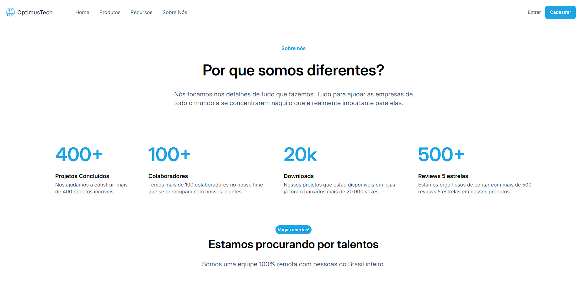

# OptimusTech - Site para Desktop

Projeto realizado no desafio #7DaysOfCode HTML e CSS da Alura

## ✔️ Técnicas e tecnologias utilizadas

- `HTML`
- `CSS`
- `GitHub`

## 📁 Acesso ao projeto

[Veja o projeto final do curso em funcionamento](https://henriquemldev.github.io/-7DaysOfCode---HTML-e-CSS/).

Neste repositório você tem acesso a todo o material produzido no curso.

## 🛠️ Abrir e rodar o projeto

Para abrir e rodar o projeto, basta abrir o aquivo `index.html` no navegador.

## 📚 Mais informações do curso

Busque na plataforma da Alura o curso **#7DaysOfCode HTML e CSS
** publicado na Escola Frontend.
